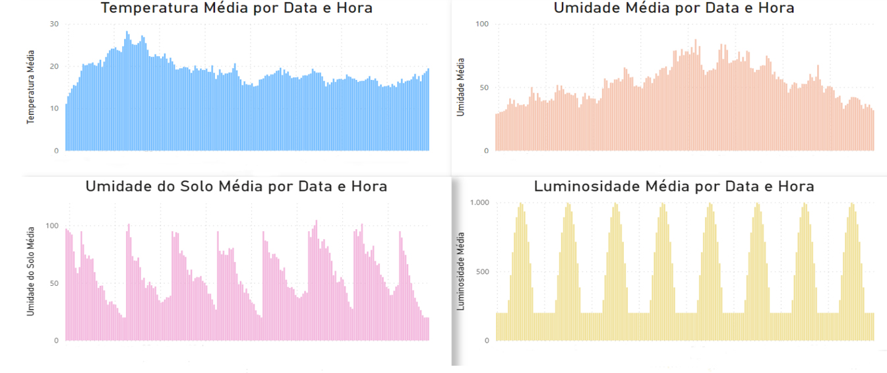
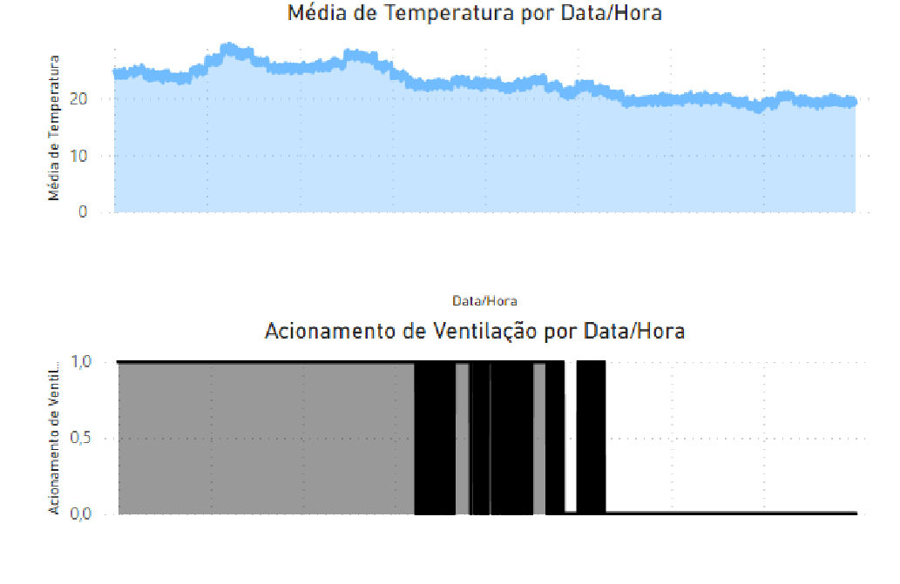

# DESENVOLVIMENTO DE UMA PLATAFORMA DE MONITORAMENTO DE CULTIVO URBANO

## Dataset

Para os testes de desempenho de envio de dados, foram gerados dados
semelhantes a um cenário real de monitoramento, para tal, foram desenvolvidos
códigos para geração e inserção de dados em um banco de dados de teste. Para a
geração foram considerados faixas pré-definidas de temperatura máxima e mínima
semelhante ao bioma brasileiro, bem como uma variação máxima entre uma
amostra ou outra, reduzindo o efeito de aleatoriedade completa, e simulando as não
idealidades dos sensores considerados para o trabalho.

## Código do sistema em funcionamento

Código responsável pela gerenciamento da temperatura

Código responsável pela gerenciamento da luminosidade

Sensor de humidade

# Output e teste de caso

## Dados brutos gerados por hora

• Para a temperatura, o ruído é ajustado para valores dentro do intervalo
de ±2 graus Celsius conforme 1% de Span definido.

• Para a umidade do solo e umidade do ar, o ruído varia dentro de um
intervalo de ±5% em relação aos valores originais conforme 10% de
Span definido.

• Para a luminosidade, o ruído introduzido varia em um intervalo que
depende do valor máximo de luminosidade em cada nó, podendo variar
em ±10% ou 20% de Span.

## Output de informação

Inicialmente, o atuador calcula a média dos parâmetros entre os três sensores
de cada nó, determinando se deve ou não acionar um atuador. Os parâmetros
considerados no teste foram:

• Temperatura Máxima: 23ºC.
• Luminosidade Mínima: 300 lúmens.
• Umidade do ar Mínima: 40%.
• Umidade do solo Mínima: 40%.

Neste cenário, é possível observar que os irrigadores seriam acionados em
momentos específicos durante a madrugada para aumentar a umidade, seguidos
pela irrigação regular programada para as 8h da manhã.

Em relação à umidade do ar, os resultados podem ser visualizados acima.
Nota-se que o acionamento ocorre em momentos específicos ao longo dos dias
e se prolonga por algumas horas quando a umidade fica abaixo de 40%.

Em relação à luminosidade, os resultados podem ser visualizados acima.
Neste cenário, não foram observadas oscilações no acionamento das lâmpadas.
Elas são acesas no momento em que há ausência de luz solar e permanecem
ligadas até o amanhecer.

## Possível melhorias

Como trabalhos futuros, seria interessante implementar um mecanismo de sugestões aliado aos alertas.
Quando o Plante alertar que a planta está recebendo mais luz
solar que o necessário, por exemplo, o Plante também poderá sugerir que o cultiva
dor realoque sua planta para um local com menos incidência solar ou implante uma
coberta sobre sua plantação. Isso facilitará ainda mais o processo de tomada de decisão.
